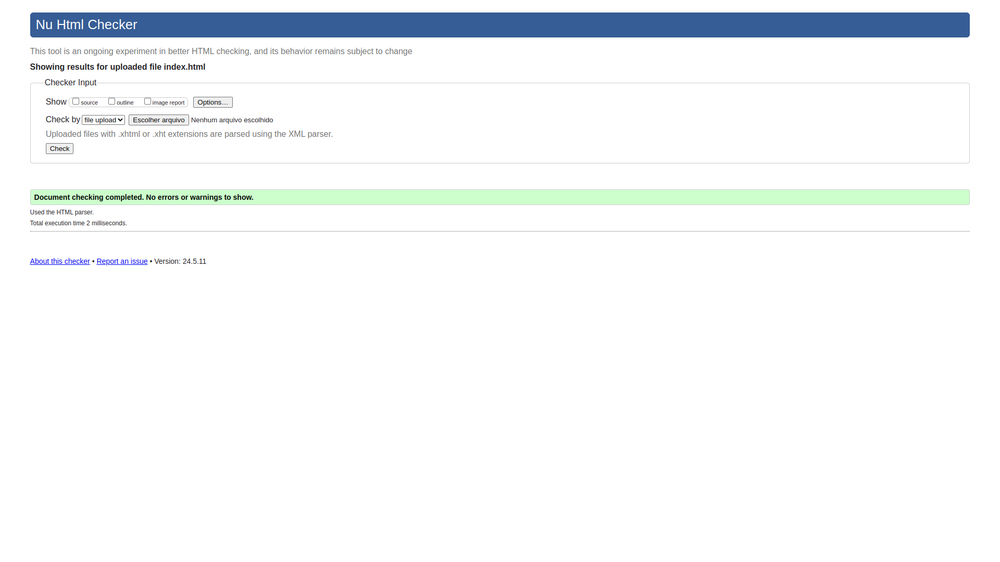
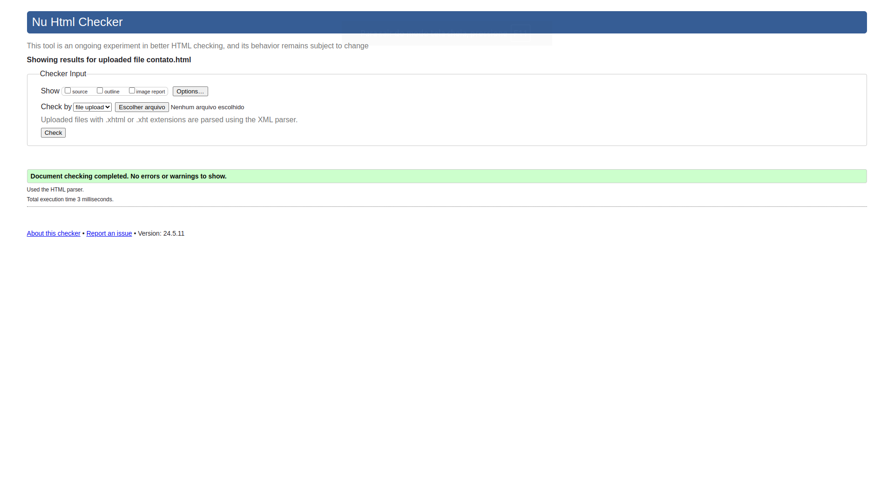

# Avaliação Bimestral
### INSTITUTO FEDERAL DE EDUCAÇÃO, CIÊNCIA E TECNOLOGIA DO PIAUÍ
### Curso: TDS
### Disciplina: Programação para a WEB front-end
### Professor: Rafael Arajújo e Ely Miranda

## Alunos: CARLOS SAMUEL FREITAS BARBOSA - Matrícula: 2023211MTDS0027
## DAVID SOUSA DA SILVA - Matrícula: 2023211MTDS0022

Criação de um Site Pessoal com Duas Páginas

Desenvolva, em equipe de até 3 pessoas, um site pessoal composto por uma página
inicial (index.html) sobre os membros da equipe e uma página de portfólio
(portifólio.html) com seus projetos e interesses. O site deve ser visualmente atraente,
organizado e fácil de navegar, implementando navegação entre páginas e aplicando
conceitos de HTML e CSS ensinados.
1. Estrutura Básica e Tags Semânticas (2 pontos):
• Crie a estrutura HTML com tags semânticas (header, main, footer) para as
páginas inicial e de portfólio.
• As páginas devem ser válidas no validador do W3C
(https://validator.w3.org/).
2. Conteúdo e Links (2 pontos):
• Use títulos e parágrafos para introduzir seções em ambas as páginas,
incluindo descrições de projetos ou habilidades na página de portfólio.
• Adicione links entre as duas páginas, além de links internos e externos
relevantes.
• Garanta navegação intuitiva entre as páginas usando links de menu, botões
ou barras de navegação estilizados com CSS.
3. Estilização, Posicionamento e Margens (2 pontos):
• Defina estilos globais em um arquivo CSS externo para garantir
consistência visual.
• Utilize CSS para posicionamento e margens, garantindo um layout
visualmente agradável e bem-organizado.

4. Formatação de Texto (1 ponto):
• Escolha e aplique fontes apropriadas para títulos, subtítulos e parágrafos.
• Ajuste o tamanho e peso (negrito) das fontes para garantir legibilidade e
hierarquia visual.
• Utilize estilos de texto (itálico, sublinhado) e espaçamento (line-height,
margin) para melhorar a leitura e a organização do conteúdo.
5. Formulários (1 ponto):
• Adicione um formulário em uma das páginas para coleta de informações ou
feedback.
• Adicione também um formulário de busca para vídeos no YouTube.
6. Imagens (1 ponto):
• Use imagens para ilustrar projetos ou habilidades na página de portfólio,
ajustando-as com CSS.
• Use imagens de menor resolução que, ao serem clicadas, levem para
imagens maiores.
7. Hospedagem (1 ponto):
• Pesquise e disponibilize o site no GitHub Pages.

Entrega: Um membro da equipe deve submeter o link do site como resposta à atividade
pelo Google Classroom até a data de entrega. Na página, deve conter o nome dos
membros da equipe.

## Resultados do validador do W3C ([https://validator.w3.org/](https://validator.w3.org/))

### index.html

### portfolio.html

### contato.html

